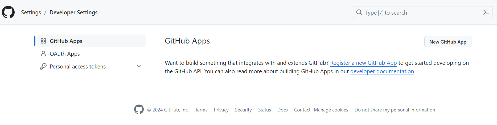
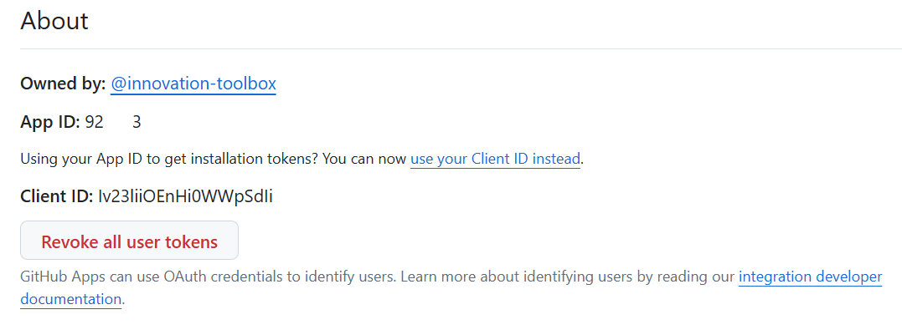
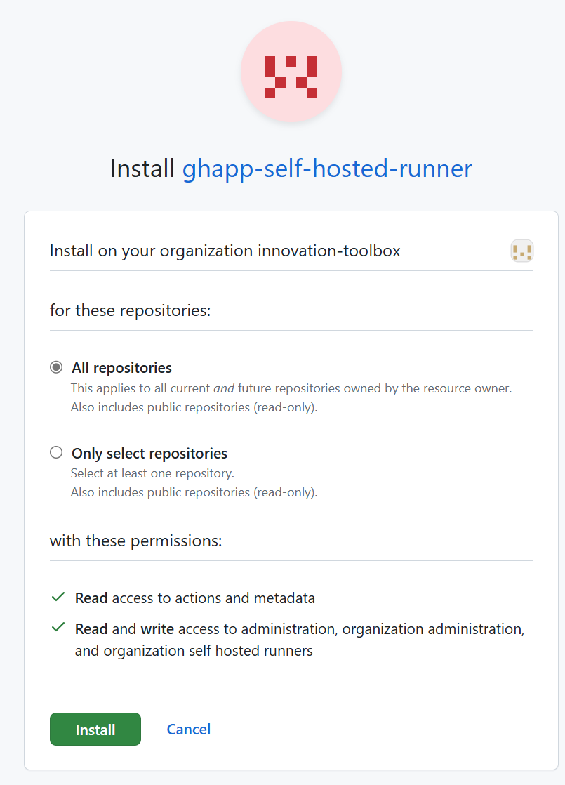
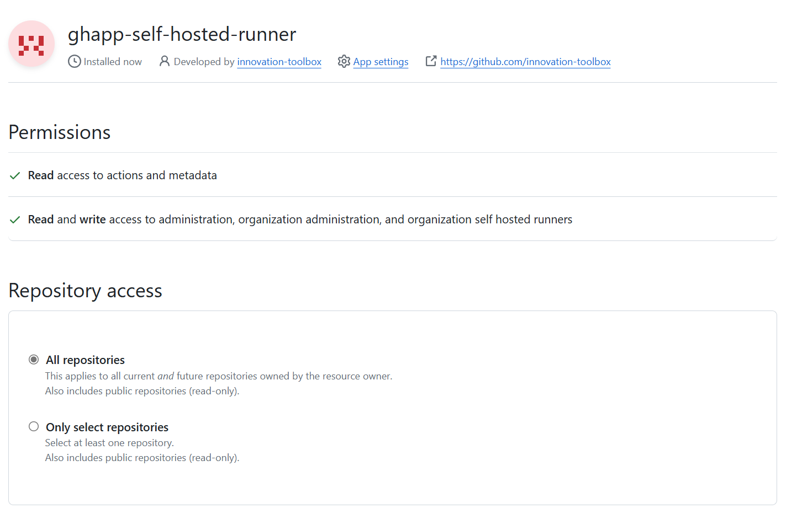
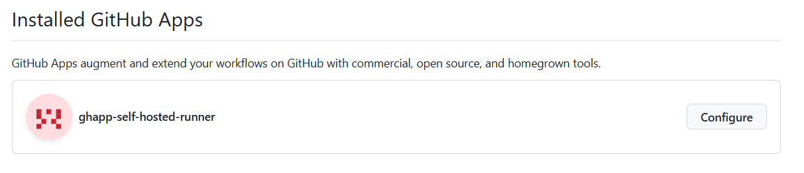
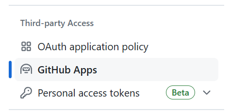

1. Set a name for the Github App
1. Set a homepage (the org url is fine for our use case)
1. Disable Webhooks
1. Set permissions ("zero-trust/least privilege" principle) depending on the level of the Self-hosted sharing desired:
   1. Repository :
      1. Actions > Read-Only
      1. Administration > Read & Write
      1. Metadata > Read-Only
   1. Organization :
      1. Repository > Actions > Read-Only
      1. Metadata > Read-only
      1. Self-hosted Runners > Read & write
1. Leave other options as default

Once created :

1. Copy the App ID somewhere you will recall
   
1. Install the GH App on the organization that will need to authenticate the self-hosted runners
   
1. Select the level of consent your wishing to give to this GHApp to authenticate self-hosted runners : At a selected repository or the entire org level :
   
1. Here's what you should have if everything went well :
   
1. Copy the IntallationID from the Installed GHApp details url (https://github.com/organizations/*your-organization*/settings/installations):
   
   

Then select App Settings from the GH App page to export the private key used to generate access token later on :

1. Select `App Settings` on your GH App details page
   1. If you closed the GH App page, you can retrieve it from `your Organization` > Settings > Github App :
      
1. Head to the bottom of `your Ghapp` > General page to generate a private key
1. Save the `.pem` file generated

# Sources : 
- [GH Self-Hosted Runner for Organizations : REST API][gh-app-sh-org-api]

[gh-app-sh-org-api]: https://docs.github.com/en/rest/actions/self-hosted-runners?apiVersion=2022-11-28#get-a-self-hosted-runner-for-an-organization
