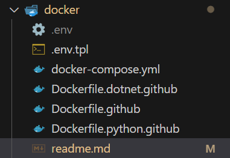

# Requirements :

1. create a `.env` file in the `/docker` folder as a duplicate of the `.env.tpl` file
1. set the variables in the new docker.env file (respect the `\n` foreach lines of the .pem file).
   

# Options to run the image locally

### Option 1 : Docker Compose

1. Head to the `/docker` folder
1. Execute the Docker compose command (force recreate if necessary)
   ```bash
   cd docker
   docker compose up --build --force-recreate
   ```

### Option 2 : Docker Build & Run

1. run the following (from _project root_ folder)
   ```bash
   export DOCKER_IMAGE="gh-shr-python"
   export DOCKER_TAG="1"
   docker build -f ./docker/Dockerfile.python.github -t ${DOCKER_IMAGE}:${DOCKER_TAG} .
   docker run --env-file ./docker/.env ${DOCKER_IMAGE}:${DOCKER_TAG}
   ```
